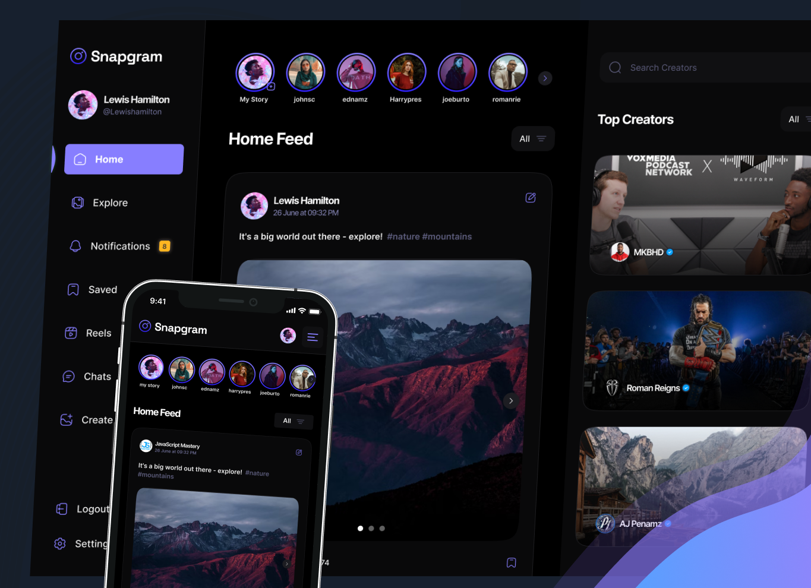

# Social Media App

Its a modern social like web app with a stunning UI with a native mobile feel, a special tech stack, an infinite scroll feature, and amazing performance using React JS, Appwrite, TypeScript, and more.

## Tech Stack

- React.js
- Appwrite
- React Query
- TypeScript
- Zod
- Shadcn
- Tailwind CSS

## Features

👉 Authentication System: A robust authentication system ensuring security and user privacy

👉 Explore Page: Homepage for users to explore posts, with a featured section for top creators

👉 Infinite Scroll Feature: Enhance user experience by implementing an infinite scroll feature, allowing users to continuously scroll through content without any interruptions.

👉 Like and Save Functionality: Enable users to like and save posts, with dedicated pages for managing liked and saved content

👉 Detailed Post Page: A detailed post page displaying content and related posts for an immersive user experience

👉 Profile Page: A user profile page showcasing liked posts and providing options to edit the profile

👉 Browse Other Users: Allow users to browse and explore other users' profiles and posts

👉 Create Post Page: Implement a user-friendly create post page with effortless file management, storage, and drag-drop feature

👉 Edit Post Functionality: Provide users with the ability to edit the content of their posts at any time

👉 Responsive UI with Bottom Bar: A responsive UI with a bottom bar, enhancing the mobile app feel for seamless navigation

👉 React Query Integration: Incorporate the React Query (Tanstack Query) data fetching library for, Auto caching to enhance performance, Parallel queries for efficient data retrieval, First-class Mutations, etc

👉 Backend as a Service (BaaS) - Appwrite: Utilize Appwrite as a Backend as a Service solution for streamlined backend development, offering features like authentication, database, file storage, and more

and many more, including code architecture and reusability
